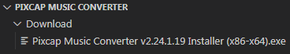
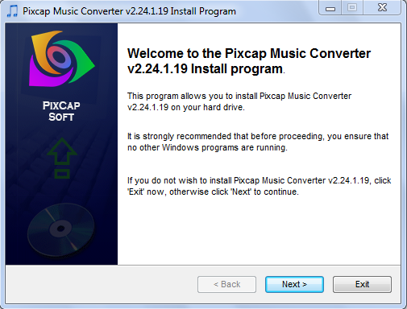
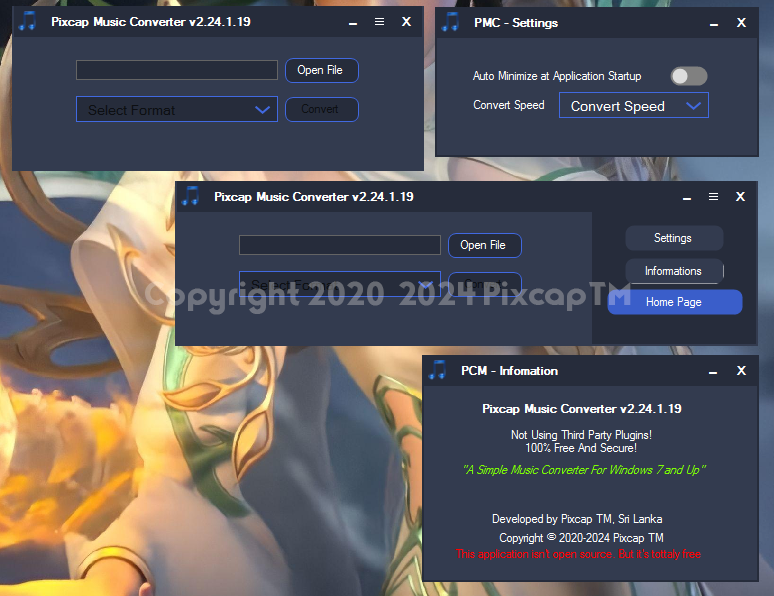

**_`Pixcap Music Converter` is a Windows software that can help you to convert music file formats._**

## Table of Contents

- [Installation](#installation)
- [System Requirements](#System-Requirements)
- [How To Use](#how-to-use)
- [Terms And Condition](#terms-and-condition)
- [License](#license)
- [About Us](#about-us)

## Installation

To download go to [Download](https://github.com/ranujasanmir/PixcapSoundConverter/tree/main/Download) folder and select any version that suitable for your system(Recommended to download latest version):

`Pixcap Music Converter` need .NET Framework 4.0.0 or higher. If you haven't that version or higher, Please install it from official Microsoft website.

You can install Pixcap Music Converter by opening installer and follow the installer.

## System-Requirements

**Minimum Sys Req -** Windows Vista, 7, 8, 8.1 and up(x86/x64), 1GB RAM, Core 2 Duo CPU (Texted - x)

**Recommended Sys Req -** Windows 7, 8, 8.1 and up(x86/x64), 2GB RAM, Core 2 Duo CPU (Tested - *)

## How To Use

PCMS is a very user friendly and lightweight application. Just Install and open.

1) Now click "Open File" button and select your music file.
2) Now Select format from drop down menu.
3) Click save and give a name.(In defualt selected file name is inclueded)

## Terms And Condition

1. **Use Responsibility**: PCMC is developed for only personal usage.

2. **Security**: Virustotal show PCMC has viruses. Don't worry. It's because we developed this application using old compiler. PCMC is 1000% secured! 

3. **Privacy**: We do not store any details about you.

## License

This project is licensed under the MIT License - see the [LICENSE](LICENSE) file for details.

## About Us

We are PixCap TM. We are from Sri Lanka. We interest on programming and software development. See our other works from this github profile.

**Copyright © 2020-2024 PixCap TM.**
**All rights Reserved.**

